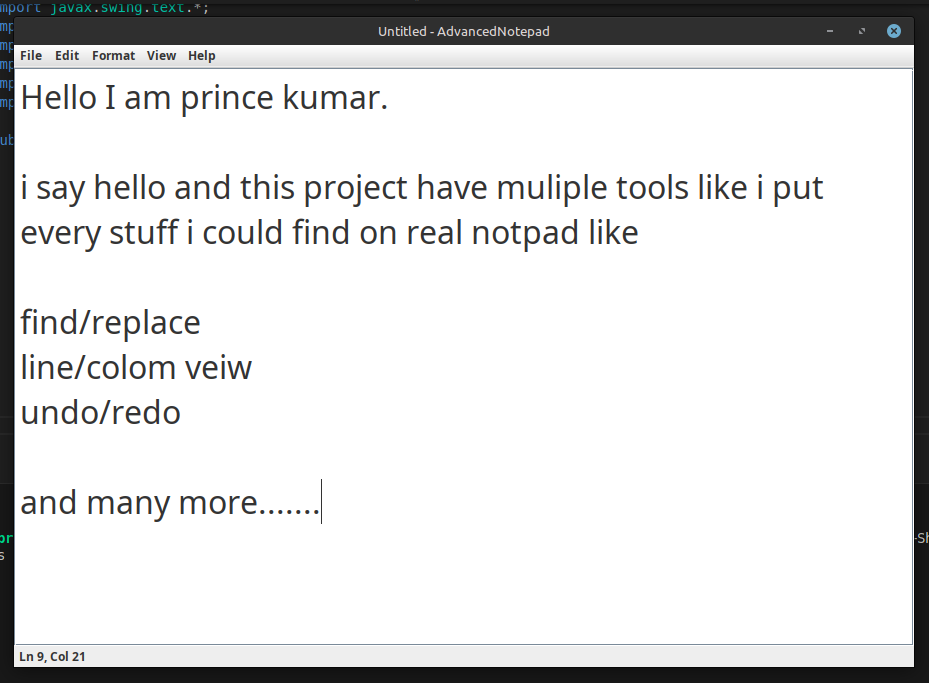

# Notepad 📝

**Notepad** is a powerful and modern text editor built in Java using Swing. It offers essential editing features along with advanced tools like Undo/Redo, Find & Replace, Font Size Control, and a live Status Bar.



---

## Features

* Simple and clean user interface
* Create, open, save, and print text files
* Undo and Redo actions
* Cut, Copy, and Paste text
* Find and Replace support (with RegEx-safe search)
* Adjustable font size (increase, decrease, reset)
* Status bar showing current line and column
* Print support with system dialog
* Prompt to save before exiting
* Keyboard shortcuts for most actions

---

## How to Use

### Run from Terminal or Command Prompt:

1. Compile the program:

   ```
   javac Notepad.java
   ```

2. Run the compiled class:

   ```
   java Notepad
   ```

### Inside the App:

* Use the **File** menu to create, open, save, or print documents.
* Use the **Edit** menu for undo/redo, cut/copy/paste, and find/replace.
* Use the **Format > Font Size** menu to change font size.
* Use **View > Show Status Bar** to toggle the status bar visibility.
* Go to **Help > About** to see app information.

---

## Author

**Prince**
Expert Academy - Java Project 2025

---

## License

This project is free to use. You may modify and distribute it as needed.

---
